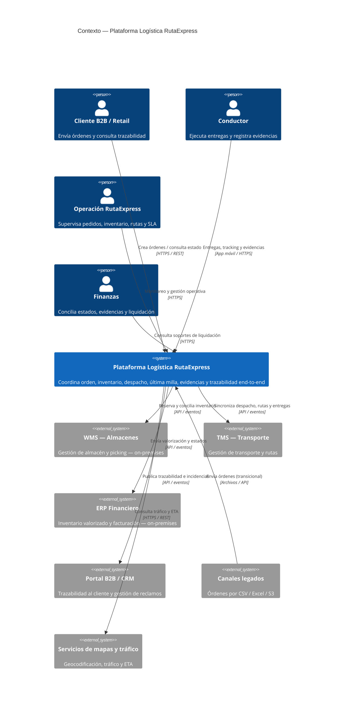

# Alternativa A (Orquestada) · C4 Nivel 1 — Contexto

**Pregunta que responde:** ¿qué sistema construimos y con quién/qué se relaciona?
**Regla:** solo sistema en alcance + personas + sistemas externos. **Sin tecnología ni contenedores.**

## Lectura para el comité
- **Alcance:** una **plataforma logística**, no una app aislada. Coordina todo el ciclo orden → entrega → liquidación.
- **Personas:** cliente B2B, conductor, operación y finanzas.
- **Sistemas externos:** WMS, TMS, ERP (los tres integrados, no reemplazados en esta fase), Portal/CRM, canales legados y servicios de mapas.
- **A este nivel las relaciones son funcionales**; el protocolo se anota como pista, pero la topología y tecnología se detallan en el Nivel 2.

## Trazabilidad a iniciativas
| Relación del contexto | Iniciativa |
|---|---|
| Crear órdenes / inventario / conciliación WMS·ERP | INI-01 (RF-01…11) |
| Integración por API y eventos con TMS, portal, legados | INI-02 (RF-12…21) |
| Entregas, tracking y evidencias del conductor | INI-03 (RF-22…29) |

> Trazabilidad al portafolio del Hito 1 (uso interno, no va en el diagrama): WMS = APP-06/07 · TMS = APP-11 · ERP = APP-25 · Portal/CRM = APP-18/20.
