# Alternativa A (Orquestada) · C4 Nivel 2 — Contenedores

**Pregunta:** ¿en qué unidades **desplegables** se divide la plataforma y con qué **tecnología y protocolo** se comunican?
**Regla:** contenedores **gruesos** (una app / un data store / una plataforma = una caja). **No** se abre el interior de ninguno (eso es Nivel 3). Cada relación lleva **protocolo**.

```mermaid
C4Container
    title Contenedores — Plataforma Logística RutaExpress TO-BE (Alternativa orquestada)

    Person(cliente, "Cliente B2B", "")
    Person(conductor, "Conductor", "App móvil")
    Person(operacion, "Operación / Finanzas", "")

    System_Boundary(plat, "Plataforma Logística RutaExpress TO-BE") {
        Container(apim, "API Gateway y Gobierno", "Azure API Management", "Único punto de entrada: contratos OpenAPI versionados, OAuth2/OIDC, rate limiting y cuotas")
        Container(oms, "OMS — Orquestador de Pedidos", "Azure AKS", "Ciclo de vida de orden e inventario: validación, deduplicación, idempotencia, estado canónico, Saga y conciliación")
        ContainerDb(sql, "BD Transaccional", "Azure SQL", "Órdenes, inventario, outbox y auditoría")
        Container(bus, "Bus de Eventos Central", "Azure Event Hubs + Service Bus", "Eventos canónicos, colas, DLQ, replay y control de secuencia")
        Container(mobile, "Backend de Última Milla", "AWS ECS/Lambda", "Store-and-forward, tracking, taxonomía de excepciones y acciones automáticas")
        ContainerDb(mobiledb, "Sincronización Móvil", "AWS DynamoDB", "Eventos offline y estado de sincronización")
        ContainerDb(evid, "Evidencias", "AWS S3 + KMS", "Fotos y firmas cifradas con hash de integridad")
        Container(analytics, "Optimización de Rutas y Analítica", "GCP (Pub/Sub, Dataflow, BigQuery, Vertex AI)", "Rutas dinámicas, SLA, predicción y tableros")
        Container(obs, "Observabilidad Unificada", "Azure Monitor + OpenTelemetry", "Trazas, métricas y correlation ID end-to-end")
        Container(iam, "Identidad y Secretos", "Entra ID + Key Vault / KMS", "Autenticación y autorización federada, gestión de secretos")
    }

    System_Ext(wms, "WMS — Almacenes", "on-premises")
    System_Ext(erp, "ERP Financiero", "on-premises")
    System_Ext(tms, "TMS — Transporte", "Gestión de transporte")
    System_Ext(portalcrm, "Portal B2B / CRM", "Trazabilidad y reclamos")
    System_Ext(legado, "Canales legados", "Órdenes CSV / Excel / S3")
    System_Ext(mapas, "Mapas y tráfico", "SaaS externo")

    Rel(cliente, apim, "Órdenes y consultas", "HTTPS/REST (OAuth2)")
    Rel(operacion, apim, "Consultas operativas", "HTTPS/REST")
    Rel(conductor, mobile, "Entregas, tracking, evidencias", "HTTPS · OAuth2 + PKCE")

    Rel(apim, oms, "Comandos y consultas de orden", "HTTPS/REST")
    Rel(oms, sql, "Lee/escribe estado y outbox", "TDS · private endpoint")
    Rel(oms, bus, "Publica eventos (patrón Outbox)", "AMQP")
    Rel(oms, wms, "Reserva física (transicional)", "API/eventos · VPN")
    Rel(oms, erp, "Valorización de inventario", "API/eventos · VPN")

    Rel(bus, mobile, "Eventos de despacho/ruta", "AMQP → bridge intercloud")
    Rel(mobile, mobiledb, "Persiste sync offline", "SDK")
    Rel(mobile, evid, "Almacena evidencias cifradas", "HTTPS · KMS")
    Rel(mobile, bus, "Publica tracking/evidencia/excepción", "bridge intercloud → AMQP")

    Rel(bus, analytics, "Stream de eventos", "AMQP → Pub/Sub bridge")
    Rel(bus, portalcrm, "Estados y excepciones", "AMQP/HTTPS")
    Rel(bus, tms, "Despacho y entregas", "AMQP/API")
    Rel(analytics, tms, "Rutas optimizadas", "HTTPS/REST")
    Rel(analytics, mapas, "Consulta tráfico y ETA", "HTTPS/REST")
    Rel(legado, apim, "Órdenes por archivo (transicional)", "HTTPS / SFTP")

    Rel(apim, iam, "Valida tokens", "OIDC")
    Rel(oms, iam, "Obtiene tokens y secretos", "OIDC / Key Vault")
    Rel(oms, obs, "Envía trazas y métricas", "OTLP")
    Rel(bus, obs, "Exporta salud de colas y DLQ", "OTLP")

    UpdateElementStyle(iam, $bgColor="grey")
    UpdateElementStyle(obs, $bgColor="grey")
    UpdateLayoutConfig($c4ShapeInRow="4", $c4BoundaryInRow="1")
```

> **Coherencia N1↔N2:** los seis sistemas externos del contexto (WMS, TMS, ERP, Portal/CRM, canales legados, mapas) aparecen también aquí — mismo alcance, más detalle. Ningún externo aparece o desaparece entre niveles.
> **Convención de flechas:** la dirección va del que **usa** al que es usado (el OMS *pide* tokens a IAM y *envía* telemetría a observabilidad, no al revés).

## Contenedores (tecnología · responsabilidad · RF)
> Los códigos APP/PLT (portafolio del Hito 1) y RF viven en esta tabla como **trazabilidad interna**; en el diagrama solo van nombres que el comité entiende.
| Contenedor | Nube / Tecnología | Responsabilidad | RF |
|---|---|---|---|
| API Gateway y Gobierno | Azure API Management | Contratos, OAuth2, cuotas, rate limiting | RF-12, RF-13 |
| **OMS — Orquestador de Pedidos** | Azure AKS (APP-02) | Orden + inventario + Saga + estado canónico | **RF-01…11** |
| BD Transaccional | Azure SQL | Estado, outbox, auditoría | RF-05, RF-07 |
| Bus de Eventos / Integración | Azure Event Hubs + Service Bus (PLT-03) | EDA, Queue-Based Load Leveling, DLQ, replay, secuencia | RF-14…21 |
| Backend Última Milla | AWS ECS/Lambda (APP-15) | Store-and-forward, excepciones, acciones | RF-22…25, 28, 29 |
| Sincronización móvil | AWS DynamoDB | Eventos offline | RF-22, RF-23 |
| Evidencias | AWS S3 + KMS (APP-16) | Fotos/firmas con hash | RF-26, RF-27 |
| Optimización y Analítica | GCP (Pub/Sub, Dataflow, BigQuery, Vertex AI) | Rutas y analítica | (habilita metas) |
| Observabilidad | PLT-01 | Trazas/métricas/correlation ID | RNF-05, RNF-15 |
| Identidad y Secretos | PLT-02 | AuthN/Z y secretos | RNF-06, RNF-13 |

## Decisiones de comunicación (protocolos)
- **Síncrono (comandos/consultas):** HTTPS/REST con OAuth2/OIDC vía API Management. Flujos según el consumidor: **Client Credentials** para sistema-a-sistema (portal B2B, legados) y **Authorization Code + PKCE** para apps con usuario (conductores).
- **Asíncrono (integración):** eventos por **AMQP** (Event Hubs/Service Bus); **patrón Outbox** desde el OMS para publicación confiable. La justificación es eliminar el **acoplamiento temporal**: productor y consumidor no necesitan estar disponibles a la vez (exactamente lo que faltó en Cyber Days).
- **El evento también es un contrato:** esquema versionado con cambios non-breaking (agregar campo opcional) y **tolerancia al cambio** (el consumidor ignora campos desconocidos). Se documenta con **AsyncAPI** *(extensión: es al evento lo que OpenAPI es al REST)*.
- **Puentes intercloud (bridges):** AWS↔Azure y GCP↔Azure sobre conectividad privada (detalle en `../anexos/despliegue_red_seguridad.md`).
- **Móvil:** HTTPS/TLS con OAuth2 + PKCE; evidencias cifradas con **KMS**.

> A diferencia del diseño anterior: **el bus NO se parte** en "bus + colas", **la analítica NO se abre** en 5 cajas, y **cada flecha lleva protocolo**. El interior del OMS y del bus se ve en el Nivel 3, no aquí.
