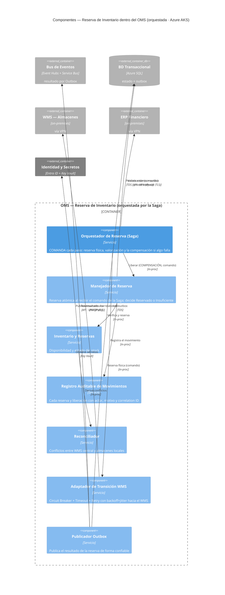

# Alternativa A (Orquestada) · C4 Nivel 3 — Componentes de Reserva de Inventario

**Pregunta:** ¿cómo se coordina la **reserva de inventario** por dentro, con qué interfaces, protocolos y controles?
**Regla:** se abre **el mismo dominio que la Alternativa B** (Inventario/Reserva) para poder compararlas caja por caja. En A este dominio vive **dentro del OMS** y lo coordina un **orquestador central (Saga)**.

> **Comparación con B:** aquí la Saga **comanda** cada paso y **ejecuta la compensación**; en B (`../alternativa_B_coreografiada/03_nivel3_componentes_inventario.md`) no hay comandante: cada componente reacciona a un evento. Mismo problema, dos formas de coordinar.

## Componentes (interfaz · responsabilidad · control · RF)
| Componente | Interfaz / Protocolo | Responsabilidad | Control | RF |
|---|---|---|---|---|
| **Orquestador de Reserva (Saga)** | in-proc (comanda) | Coordina reserva física + valorización y **ejecuta la compensación** | Punto único de control y visibilidad | RF-08 |
| Manejador de Reserva | in-proc | Reserva atómica; solo una gana ante concurrencia | Transacción sobre la BD | RF-06 |
| Inventario y Reservas | in-proc | Disponibilidad y estado del stock | — | RF-06 |
| Registro Auditable | in-proc | Reserva/liberación con actor, motivo, correlation ID | Sin borrado, solo apéndice | RF-07 |
| Reconciliador | in-proc | Conflictos WMS central vs. locales | Trazabilidad | RF-09 |
| Adaptador de Transición WMS | API · VPN (IPsec) | Convivencia con WMS on-prem | Circuit Breaker + Timeout + Retry | RF-11 |
| Publicador Outbox | AMQP · TLS | Publicación confiable del resultado | Secretos en Key Vault | RF-14 |

## Contraste directo A vs B (mismo dominio: reserva de inventario)
| Aspecto | **A — Orquestada (este diagrama)** | **B — Coreografiada** |
|---|---|---|
| ¿Quién dispara la reserva? | La **Saga** comanda al Manejador de Reserva | Un **evento** (OrdenValidada) llega por el Inbox |
| Compensación (liberar) | La **Saga la ordena** (comando "Liberar") | El propio servicio **reacciona** a ValorizaciónRechazada |
| Valorización en ERP | La Saga la **comanda** directamente | Un adaptador la hace al oír el evento y publica el resultado |
| Forma del diagrama | **Hub**: casi todas las flechas salen de la Saga | **Cadena**: evento → manejador → evento, sin centro |
| Ventaja | Control y visibilidad centrales | Autonomía y desacoplamiento |

> Nota: la validación, deduplicación e idempotencia de la orden (RF-01…05) ocurren aguas arriba en el mismo OMS; aquí se enfoca **solo el sub-dominio de reserva** para el contraste con B. El ciclo completo de la orden está en el Nivel 2.
