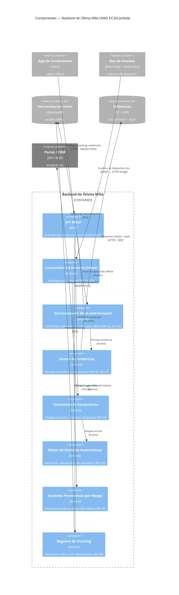

# Alternativa A (Orquestada) · C4 Nivel 3 — Componentes del Backend de Última Milla

**Pregunta:** ¿cómo funciona por dentro el **Backend de Última Milla** (AWS), que da soporte a la operación offline, la sincronización confiable y las evidencias?
**Regla:** se abre **UN** contenedor (Última Milla). Es el corazón de INI-03 (RF-22…29). Los demás aparecen como cajas externas de borde.

## Componentes (responsabilidad · RF)
| Componente | Responsabilidad | RF |
|---|---|---|
| API Móvil | Entrada del conductor (OAuth2+PKCE) | RF-22 |
| Consumidor de Eventos (Inbox) | Dedup por eventId (idempotencia) | RF-16, RF-23 |
| Sincronización Store-and-Forward | Confirmación backend + reintento de lo offline | RF-22, RF-23 |
| Gestor de Evidencias | Vínculo a la orden + hash de integridad | RF-26, RF-27 |
| Taxonomía de Excepciones | Código canónico + motivo obligatorio | RF-24 |
| Motor de Acciones Automáticas | Reintento / devolución / escalamiento | RF-25 |
| Acciones Preventivas por Riesgo | Prevención por dirección/ausencia | RF-29 |
| Registro de Tracking | Ubicación cada 2 min, deduplicada | RF-28 |

**Lo que demuestra:** la última milla resiliente — el conductor opera sin señal, nada se pierde al sincronizar (store-and-forward), y las evidencias con hash sostienen la liquidación (los USD 2.4M retenidos del caso).
