# Alternativa B (Coreografiada) · C4 Nivel 2 — Contenedores

**Pregunta:** ¿en qué unidades **desplegables** se divide la plataforma y con qué **tecnología y protocolo** se comunican?
**Regla:** contenedores **gruesos**, sin abrir su interior (eso es Nivel 3). Cada relación lleva **protocolo**.

## En qué se diferencia de la Alternativa A (la decisión de fondo)
- **A (orquestada):** el OMS contiene un orquestador central (Saga) que **comanda** la reserva en WMS y la valorización en ERP, y compensa si algo falla. Control y visibilidad centrales.
- **B (coreografiada):** **no hay orquestador**. Cada servicio es autónomo: **reacciona a eventos y publica eventos**. El **log de eventos es la fuente de verdad (Event Sourcing)** y las vistas de consulta se **proyectan** desde él (CQRS). La compensación también es un evento: quien reservó, escucha el rechazo y libera.
- La **huella multinube es la misma** en ambas (Azure núcleo, AWS última milla, GCP analítica) **a propósito**: así el comité compara **arquitecturas**, no proveedores. La ubicación del hub es un ADR aparte (`../decisiones_diseño.md`).

```mermaid
C4Container
    title Contenedores — Plataforma RutaExpress (Alternativa B coreografiada)

    Person(cliente, "Cliente B2B", "")
    Person(conductor, "Conductor", "App móvil")
    Person(operacion, "Operación / Finanzas", "")

    System_Boundary(plat, "Plataforma Logística RutaExpress") {
        Container(apim, "API Gateway y Gobierno", "Azure API Management", "Único punto de entrada: contratos OpenAPI versionados, OAuth2/OIDC, rate limiting y cuotas")
        Container(oms, "Servicio de Órdenes", "Azure AKS", "Recepción, validación, deduplicación e idempotencia; publica eventos de orden; SIN orquestador")
        Container(inv, "Servicio de Inventario", "Azure AKS", "Autónomo: reserva al escuchar OrdenValidada, publica el resultado, se compensa por eventos")
        Container(eventlog, "Log de Eventos (fuente de verdad)", "Azure Event Hubs + Service Bus", "Event Sourcing: eventos canónicos retenidos y reproducibles; colas de trabajo, DLQ y replay")
        Container(query, "Servicio de Consultas (CQRS)", "Azure AKS + Azure SQL", "API de lectura sobre proyecciones: estado de orden, disponibilidad y trazabilidad")
        Container(adaptadores, "Adaptadores WMS/ERP", "Azure AKS", "Escuchan eventos, traducen al WMS/ERP on-premises y publican el resultado como evento")
        Container(mobile, "Backend de Última Milla", "AWS ECS/Lambda", "Store-and-forward, tracking y excepciones; consume y publica eventos")
        ContainerDb(mobiledb, "Sincronización Móvil", "AWS DynamoDB", "Eventos offline y estado de sincronización")
        ContainerDb(evid, "Evidencias", "AWS S3 + KMS", "Fotos y firmas cifradas con hash de integridad")
        Container(analytics, "Optimización de Rutas y Analítica", "GCP (Pub/Sub, Dataflow, BigQuery, Vertex AI)", "Consume el stream de eventos; rutas dinámicas y predicción")
        Container(obs, "Observabilidad Unificada", "Azure Monitor + OpenTelemetry", "Trazas, métricas y correlation ID end-to-end")
        Container(iam, "Identidad y Secretos", "Entra ID + Key Vault / KMS", "Autenticación y autorización federada, gestión de secretos")
    }

    System_Ext(wms, "WMS — Almacenes", "on-premises")
    System_Ext(erp, "ERP Financiero", "on-premises")
    System_Ext(tms, "TMS — Transporte", "Gestión de transporte")
    System_Ext(portalcrm, "Portal B2B / CRM", "Trazabilidad y reclamos")
    System_Ext(legado, "Canales legados", "Órdenes CSV / Excel / S3")
    System_Ext(mapas, "Mapas y tráfico", "SaaS externo")

    Rel(cliente, apim, "Órdenes y consultas", "HTTPS/REST (OAuth2)")
    Rel(operacion, apim, "Consultas operativas", "HTTPS/REST")
    Rel(conductor, mobile, "Entregas, tracking, evidencias", "HTTPS · OAuth2 + PKCE")
    Rel(legado, apim, "Órdenes por archivo (transicional)", "HTTPS / SFTP")

    Rel(apim, oms, "Comandos de orden", "HTTPS/REST")
    Rel(apim, query, "Consultas de estado y disponibilidad", "HTTPS/REST · solo lectura")
    Rel(oms, eventlog, "Publica OrdenValidada (Outbox)", "AMQP")
    Rel(eventlog, inv, "Entrega OrdenValidada / ValorizacionRechazada", "AMQP")
    Rel(inv, eventlog, "Publica InventarioReservado / Insuficiente / Liberado", "AMQP")
    Rel(eventlog, adaptadores, "Entrega eventos de reserva/valorización", "AMQP")
    Rel(adaptadores, wms, "Reserva física", "API · VPN site-to-site (IPsec)")
    Rel(adaptadores, erp, "Valorización", "API · VPN site-to-site (IPsec)")
    Rel(adaptadores, eventlog, "Publica el resultado como evento", "AMQP")
    Rel(eventlog, query, "Proyecta estados y disponibilidad", "AMQP → proyector")

    Rel(eventlog, mobile, "Eventos de despacho/ruta", "AMQP → HTTPS bridge")
    Rel(mobile, mobiledb, "Persiste sync offline", "SDK")
    Rel(mobile, evid, "Almacena evidencias cifradas", "HTTPS · KMS")
    Rel(mobile, eventlog, "Publica tracking/evidencia/excepción", "HTTPS → AMQP bridge")

    Rel(eventlog, analytics, "Stream de eventos", "AMQP → Pub/Sub bridge")
    Rel(eventlog, portalcrm, "Estados y excepciones", "AMQP/HTTPS")
    Rel(eventlog, tms, "Despacho y entregas", "AMQP/API")
    Rel(analytics, tms, "Rutas optimizadas", "HTTPS/REST")
    Rel(analytics, mapas, "Consulta tráfico y ETA", "HTTPS/REST")

    Rel(apim, iam, "Valida tokens", "OIDC")
    Rel(oms, iam, "Obtiene tokens y secretos", "OIDC / Key Vault")
    Rel(oms, obs, "Envía trazas y métricas", "OTLP")
    Rel(eventlog, obs, "Exporta salud de colas y DLQ", "OTLP")

    UpdateElementStyle(iam, $bgColor="grey")
    UpdateElementStyle(obs, $bgColor="grey")
    UpdateLayoutConfig($c4ShapeInRow="4", $c4BoundaryInRow="1")
```

## Contenedores (tecnología · responsabilidad · RF)
> Los códigos APP/PLT (portafolio del Hito 1) y RF viven en esta tabla como **trazabilidad interna**; en el diagrama solo van nombres que el comité entiende.

| Contenedor | Nube / Tecnología | Responsabilidad | RF |
|---|---|---|---|
| API Gateway y Gobierno | Azure API Management | Contratos, OAuth2, cuotas | RF-12, RF-13 |
| Servicio de Órdenes | Azure AKS (APP-02) | Validación, dedup, idempotencia; publica eventos | RF-01…05 |
| **Servicio de Inventario** | Azure AKS | **Autónomo por eventos**: reserva, libera, compensa | RF-06…09 |
| **Log de Eventos** | Event Hubs + Service Bus (PLT-03) | **Event Sourcing**: fuente de verdad, DLQ, replay | RF-14…21 |
| **Servicio de Consultas (CQRS)** | Azure AKS + Azure SQL | API de lectura sobre proyecciones | RF-10 |
| Adaptadores WMS/ERP | Azure AKS | Traducen eventos ↔ on-prem | RF-11 |
| Backend Última Milla | AWS ECS/Lambda (APP-15) | Store-and-forward, excepciones | RF-22…25, 28, 29 |
| Sincronización móvil | AWS DynamoDB | Eventos offline | RF-22, RF-23 |
| Evidencias | AWS S3 + KMS (APP-16) | Fotos/firmas con hash | RF-26, RF-27 |
| Optimización y Analítica | GCP | Rutas y analítica sobre el stream | (habilita metas) |
| Observabilidad / IAM | PLT-01 / PLT-02 | Transversales | RNF-05/06/13/15 |

## La Saga coreografiada (flujo de reserva sin orquestador)
1. `OMS` publica **OrdenValidada** → 2. `Inventario` la escucha, reserva y publica **InventarioReservado** → 3. `Adaptador ERP` la escucha, valoriza y publica **ValorizacionConfirmada** (o **Rechazada**) → 4. si fue **Rechazada**, `Inventario` la escucha y publica **InventarioLiberado** (compensación) → 5. los **proyectores** actualizan los read models y el portal/TMS ven el estado final.
Nadie comanda a nadie: **cada paso es una reacción a un evento**, y el replay del log reconstruye cualquier estado (RF-19).

> Trade-off (para el comité): se gana autonomía, desacoplamiento y auditoría nativa (el log ES la historia); se paga con flujo más difícil de seguir — nadie "ve" la Saga completa, hay que reconstruirla con el correlation ID — y con consistencia eventual en todas las lecturas.
