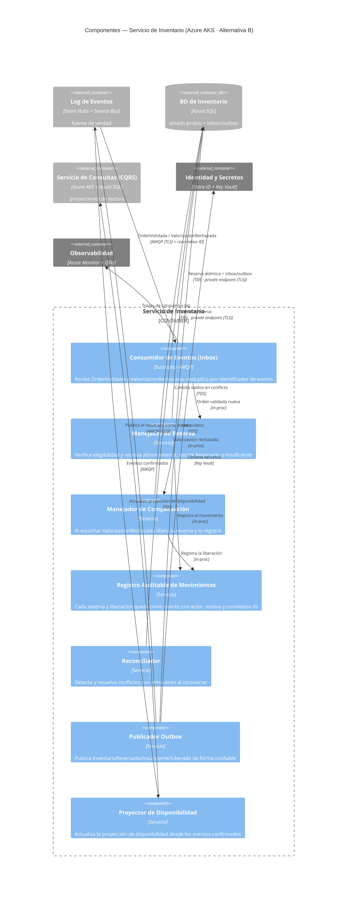

# Alternativa B (Coreografiada) · C4 Nivel 3 — Componentes del Servicio de Inventario

**Pregunta:** ¿cómo funciona por dentro un servicio **coreografiado**, con qué **interfaces, protocolos y controles**?
**Regla:** se abre **UN** contenedor. Se elige el **Servicio de Inventario** porque es donde la coreografía se ve completa: reacciona a eventos, decide solo, publica el resultado y **se compensa a sí mismo** — el contraste directo con el orquestador de la Alternativa A.

> Los adaptadores WMS/ERP reciben los eventos de reserva directamente del log (se ve en el Nivel 2); aquí se omite esa relación porque no involucra al contenedor abierto. Los códigos RF de cada componente están en la tabla de abajo.

## Componentes (interfaz · responsabilidad · control · RF)
| Componente | Interfaz / Protocolo | Responsabilidad | Control | RF |
|---|---|---|---|---|
| Consumidor de Eventos (Inbox) | AMQP · TLS | Suscripción y **deduplicación por identificador de evento** | Idempotencia del consumidor (patrón Inbox) | RF-16 |
| Manejador de Reserva | in-proc | Reserva atómica: solo una gana ante concurrencia | Transacción sobre BD propia | RF-06 |
| Manejador de Compensación | in-proc | Libera al escuchar el rechazo — **compensación sin orquestador** | Auditoría obligatoria | RF-08 |
| Registro Auditable | in-proc | Todo movimiento con actor, motivo, correlation ID | Sin borrado, solo apéndice | RF-07 |
| Reconciliador | in-proc | Conflictos al reconectar almacenes | Trazabilidad | RF-09 |
| Publicador Outbox | AMQP · TLS | Publicación confiable del resultado | Secretos en Key Vault | RF-14 |
| Proyector (CQRS) | AMQP → TDS | Read model de disponibilidad | Solo lectura para consultas | RF-10 |

## Contraste con el Nivel 3 de la Alternativa A (lo que el comité debe ver)
| Aspecto | A — OMS orquestador | B — Inventario coreografiado |
|---|---|---|
| ¿Quién coordina la reserva? | El **Orquestador Saga** dentro del OMS comanda WMS y ERP | **Nadie**: cada servicio reacciona al evento anterior |
| Compensación | El orquestador la ejecuta y la ve completa | El propio servicio se compensa al escuchar el rechazo |
| Fuente de verdad | Estado en Azure SQL del OMS | **El log de eventos** (Event Sourcing); el estado se reconstruye |
| Seguimiento de un pedido | Consultar al orquestador | Reconstruir por **correlation ID** a través del log |
| Idempotencia | Idempotency key en la API | **Inbox** por identificador de evento en cada consumidor |
