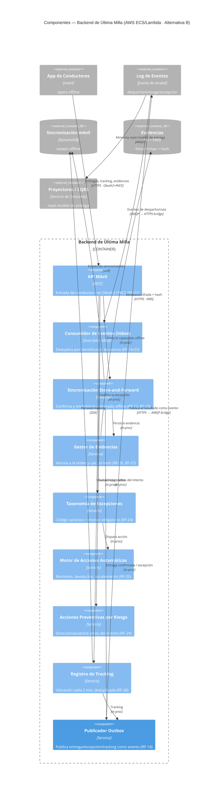

# Alternativa B (Coreografiada) · C4 Nivel 3 — Componentes del Backend de Última Milla

**Pregunta:** ¿cómo funciona por dentro el **Backend de Última Milla** (AWS) en la Alternativa B, donde es **un participante más de la coreografía**: consume eventos del log, actúa y publica su propio resultado como evento?
**Regla:** se abre **UN** contenedor (Última Milla). Es el corazón de INI-03 (RF-22…29). Los demás aparecen como cajas externas de borde.

> **Diferencia con A:** los componentes internos son casi los mismos que en A (`../alternativa_A_orquestada/03c_nivel3_componentes_ultima_milla.md`) — la última milla ya es reactiva por naturaleza (offline, store-and-forward). El cambio de B está en el **borde**: aquí publica y consume contra el **Log de Eventos (fuente de verdad)**, no contra un bus de transporte, y su estado también es reconstruible por replay. No hay orquestador que le indique qué hacer: **reacciona a eventos de despacho y publica eventos de entrega/excepción**.

## Componentes (responsabilidad · RF)
| Componente | Responsabilidad | RF |
|---|---|---|
| API Móvil | Entrada del conductor (OAuth2+PKCE) | RF-22 |
| Consumidor de Eventos (Inbox) | Dedup por identificador de evento | RF-16, RF-23 |
| Sincronización Store-and-Forward | Confirmación backend + reintento de lo offline | RF-22, RF-23 |
| Gestor de Evidencias | Vínculo a la orden + hash de integridad | RF-26, RF-27 |
| Taxonomía de Excepciones | Código canónico + motivo obligatorio | RF-24 |
| Motor de Acciones Automáticas | Reintento / devolución / escalamiento | RF-25 |
| Acciones Preventivas por Riesgo | Prevención por dirección/ausencia | RF-29 |
| Registro de Tracking | Ubicación cada 2 min, deduplicada | RF-28 |
| **Publicador Outbox** | **Publica entrega/excepción/tracking como evento al log** | RF-14 |

## Contraste con el Nivel 3 de la Alternativa A (mismo dominio: última milla)
| Aspecto | A — Última Milla | B — Última Milla (este) |
|---|---|---|
| Recibe el despacho | Evento del bus (transporte) | Evento del **log (fuente de verdad)** |
| Publica el resultado | Al bus, para que el OMS lo vea | Al **log**, como nuevo hecho inmutable |
| Coordinación | El OMS orquesta el flujo global | **Coreografía**: reacciona y publica, nadie la comanda |
| Componentes internos | Prácticamente idénticos (offline-first) | Prácticamente idénticos + **Outbox explícito** |

**Lo que demuestra:** la última milla resiliente es igual de robusta en ambas alternativas (el conductor opera sin señal, nada se pierde con store-and-forward, evidencias con hash sostienen los USD 2.4M). Lo que cambia en B es su **relación con el resto**: es un participante autónomo de la coreografía que publica hechos al log, no un ejecutor de órdenes del orquestador.
