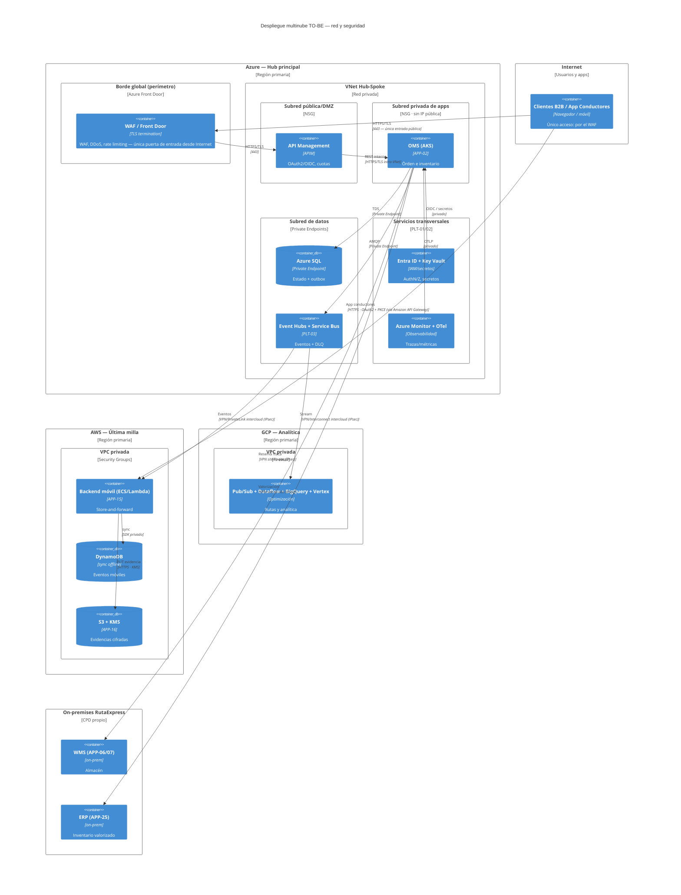

# C4 · Despliegue, Red y Seguridad

**Pregunta:** ¿dónde se **despliega** cada contenedor, cómo se **conectan las nubes** entre sí y con on-premises, y qué **zonas y controles de seguridad** aplican?
**Regla:** aquí sí se muestra infraestructura: regiones, VNet/VPC, subredes, private endpoints, conectividad intercloud (VPN/peering), zonas (WAF/DMZ/privada), IAM y cifrado. **Sin** lógica de negocio.

> Este diagrama es el que **faltaba**. El feedback del profesor fue exactamente este nivel: *ver la red, cómo se conectan y la seguridad.*

## Diagrama de despliegue

## Zonas de seguridad
| Zona | Qué contiene | Controles |
|---|---|---|
| **Borde (capa 7)** | Front Door + WAF + API Management | TLS termination, WAF, DDoS, rate limiting, OAuth2/OIDC |
| **Apps (subred privada)** | OMS (AKS), backend móvil | Sin IP pública, NSG/Security Groups con **deny by default**, TLS intra-red |
| **Datos (subred privada)** | Azure SQL, bus, DynamoDB, S3 | **Private Endpoints**, cifrado en reposo, "bases de datos nunca en subredes públicas" |
| **Transversal** | Entra ID, Key Vault, Observabilidad | IAM federada, secretos gestionados, trazabilidad |
| **On-premises** | WMS, ERP | Solo accesibles por **VPN site-to-site (IPsec)** |

## Conectividad intercloud (cómo se conectan las nubes)
| Enlace | Mecanismo (fase inicial) | Evolución (mayor volumen) | Cifrado |
|---|---|---|---|
| Azure ↔ AWS | VPN site-to-site (IPsec) | ExpressRoute + Direct Connect | IPsec + mTLS |
| Azure ↔ GCP | VPN site-to-site (IPsec) | ExpressRoute + Cloud Interconnect | IPsec + mTLS |
| Azure ↔ On-prem | VPN site-to-site (IPsec) | ExpressRoute | IPsec + mTLS |
| Móvil ↔ AWS | HTTPS + OAuth2 (Authorization Code + PKCE) | — | TLS + KMS (evidencias) |

> **mTLS** *(extensión de industria)*: además del túnel IPsec, los servicios que cruzan de una nube a otra se autentican mutuamente con certificados. Justificación: **defensa en profundidad** — nunca depender de un único mecanismo; si el túnel se compromete, el servicio ajeno igual no puede hablar con los nuestros.

> Los rangos **CIDR de las tres redes privadas no se solapan** (p. ej. Azure VNet 10.0.0.0/16, AWS VPC 10.1.0.0/16, GCP VPC 10.2.0.0/16) — requisito para poder enrutar entre nubes por VPN sin colisiones.

## Controles de seguridad transversales (RNF)
Principio rector: **Zero Trust** — "nunca confiar, siempre verificar" — con **defensa en profundidad** (ninguna protección depende de un único mecanismo):
- **Identidad como nuevo perímetro:** AuthN/Z federada con Entra ID hacia AWS y GCP; tokens OAuth2/OIDC (JWT) validados en el borde; **mínimo privilegio (PoLP)** en todos los roles — nada de Owner/AdministratorAccess/wildcard (RNF-13).
- **Red:** segmentación por capas (borde / apps / datos), NSG y Security Groups con **deny by default**, NAT Gateway para salidas desde subredes privadas, **Flow Logs habilitados** para auditoría de red.
- **Secretos** en Key Vault / Secrets Manager; rotación gestionada, cero secretos hardcodeados (RNF-06).
- **Cifrado**: TLS 1.2+ en tránsito en todos los enlaces; en reposo con KMS/Key Vault en SQL, S3, DynamoDB y bus (RNF-06, RNF-20, RNF-25).
- **Aislamiento de datos**: todo data store en subred privada con **Private Endpoint**; nada de bases de datos con IP pública.
- **Auditoría**: CloudTrail (AWS), Azure Monitor / Activity Log (Azure) y Cloud Audit Logs (GCP) activos; **observabilidad y correlation ID** end-to-end para trazar una orden a través de las 3 nubes (RNF-05, RNF-15).
- **Resiliencia**: DLQ + replay en el bus; store-and-forward en móvil; la caída de una nube no tumba las otras (RNF-01…04 de disponibilidad).

## Estrategia de recuperación ante desastres (DR — Módulo 3, Sesión 4)
El caso nace de una indisponibilidad real (WMS caído 6 h en Cyber Days → 240k órdenes encoladas, USD 1.1M en penalidades). Por eso el despliegue declara una estrategia DR **por criticidad**, no una sola para todo:

La estrategia se elige por el trade-off **RTO** (¿cuánto tiempo puede estar inactivo el negocio?) / **RPO** (¿cuántos datos podemos perder?) / **costo** — el criterio de selección enseñado en clase.

| Ámbito | Estrategia | RTO / RPO objetivo | Por qué esa y no otra |
|---|---|---|---|
| Núcleo transaccional Azure (OMS, SQL, bus) | **Warm Standby** en región pareada (geo-replicación de SQL, namespace secundario del bus) | Minutos / segundos–minutos | Es la ruta crítica del negocio; **Backup and Restore** tardaría horas (inaceptable tras las 6 h de Cyber Days) y **Multi-Site Active/Active** duplica costo sin necesidad |
| Evidencias (S3) | **Replicación cross-region + versionado** | Minutos / ≈ cero | Las evidencias sostienen la liquidación (USD 2.4M retenidos); perderlas no tiene reproceso posible |
| Sincronización móvil (DynamoDB) | Backup continuo (PITR) | Decenas de minutos / minutos | El dato maestro se reconstruye desde los eventos; basta punto de restauración |
| Analítica GCP | **Backup and Restore** | Horas / horas | No es ruta transaccional crítica; RTO de horas es aceptable |
| Última milla (conductor) | **Store-and-forward en el dispositivo** (RF-22, RF-23) | — (opera degradado, no cae) | La resiliencia se resuelve en el borde: el conductor sigue operando sin conectividad, con o sin desastre |

> Lectura clave para el comité: la indisponibilidad de **una** nube no tumba a las otras — el bus desacopla (los eventos se encolan y se reprocesan con replay), y el móvil opera offline. Eso es exactamente lo que faltó en Cyber Days.

## Trazabilidad de despliegue
| Contenedor | Nube / Nodo | Justificación de ubicación |
|---|---|---|
| WAF + APIM | Azure (borde) | Gobierno de API ya en Azure; punto único de entrada |
| OMS + SQL + Bus + IAM + Obs | Azure (privada) | Núcleo transaccional y de integración; menor latencia entre ellos |
| Backend móvil + DynamoDB + S3 | AWS | Última milla y evidencias ya operan en AWS (best-of-breed) |
| Analítica y rutas | GCP | BigQuery/Vertex para optimización y predicción |
| WMS + ERP | On-premises | Sistemas legados que en esta fase se integran, no se migran |
