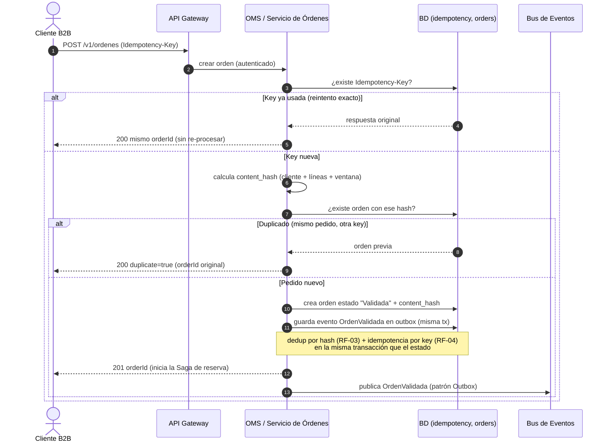

# Secuencia — Recepción de orden: deduplicación + idempotencia

Cómo el OMS evita el doble procesamiento (los **32k pedidos duplicados** del caso). Aplica a ambas alternativas (ocurre en el Servicio de Órdenes / OMS). RF-01, RF-03, RF-04, RF-05.

**Lo que demuestra:** un reintento con la **misma key** no crea nada nuevo (idempotencia); el **mismo pedido con otra key** se detecta por **hash de contenido** (deduplicación). Los dos mecanismos juntos cierran la puerta a los duplicados del caso.
