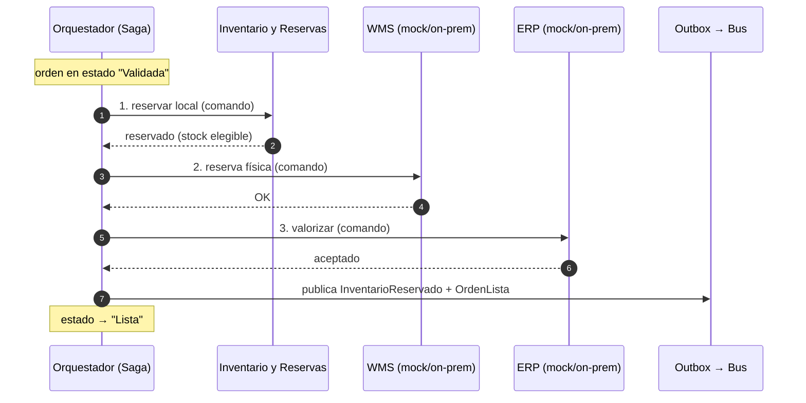
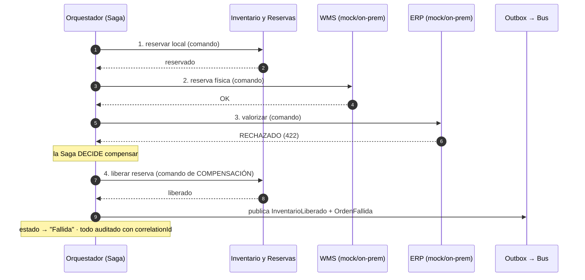

# Secuencia — Reserva en Alternativa A (Saga ORQUESTADA)

El **Orquestador (Saga)** comanda cada paso y ejecuta la compensación. Fíjate que todas las flechas de decisión **salen de la Saga**: hay un punto único de control. RF-06, RF-07, RF-08.

## Caso 1 — Éxito (reserva completa)

## Caso 2 — Compensación (el ERP rechaza)

**Lo que demuestra:** en A la coordinación y la compensación son **centralizadas** — la Saga ve el flujo completo y ordena el "liberar". Ventaja: control y visibilidad en un solo lugar (RF-08).
