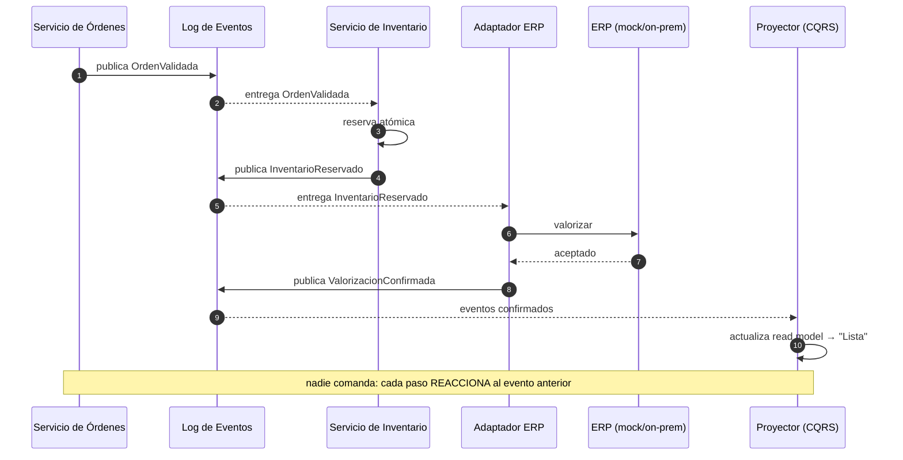
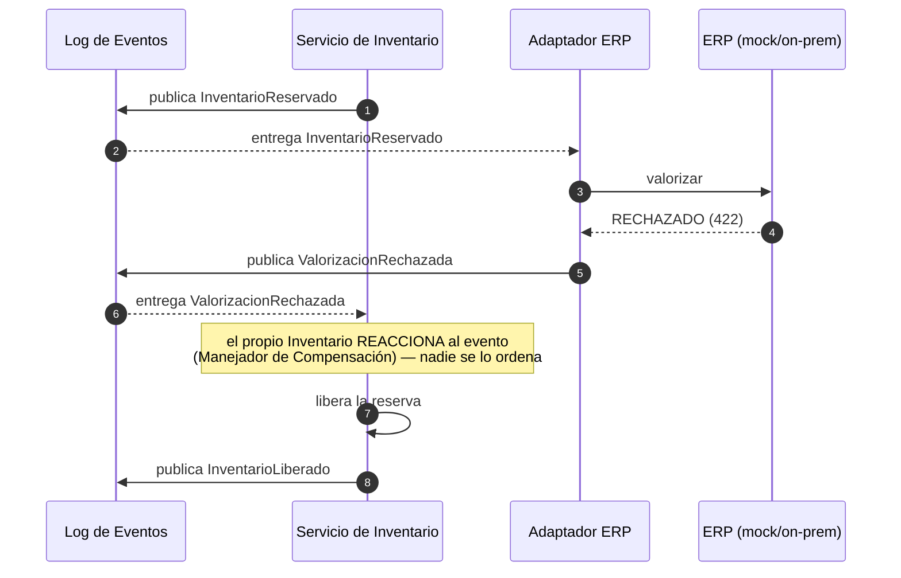

# Secuencia — Reserva en Alternativa B (Saga COREOGRAFIADA)

**Mismo escenario que en A**, pero **no hay orquestador**: cada servicio reacciona a un evento del **Log de Eventos** y publica el siguiente. La compensación también es un **evento**, no un comando. Compárese caja por caja con `02_saga_A_orquestada.md`.

## Caso 1 — Éxito (por eventos)

## Caso 2 — Compensación (el ERP rechaza)

**Lo que demuestra:** en B la compensación **la dispara un evento** (`ValorizacionRechazada`), no un comando central. Ventaja: autonomía y desacoplamiento; costo: el flujo hay que reconstruirlo con el `correlationId` porque **nadie lo ve completo**.

---
### El contraste, en una línea
- **A (02):** `Saga → INV → WMS → ERP`, y la Saga **ordena** liberar. Estrella = la Saga.
- **B (03):** `evento → INV → evento → ERP → evento`, y el rechazo **gatilla** la liberación. Estrella = el Log de Eventos.
