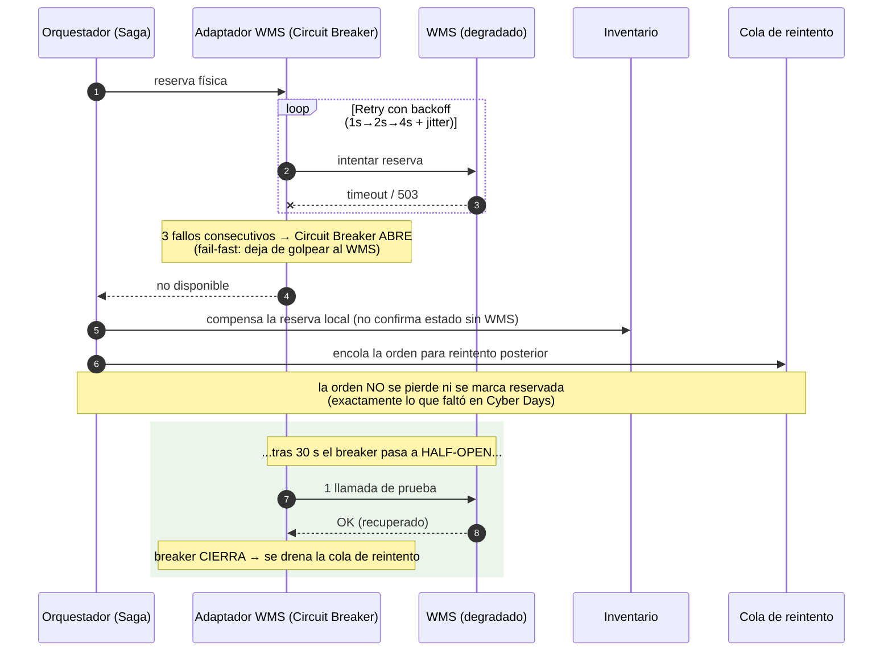

# Secuencia — Resiliencia hacia el WMS (la lección de Cyber Days)

El WMS es el sistema que se cayó **6 h** en Cyber Days (240k órdenes encoladas). El adaptador aplica **Timeout + Retry (backoff+jitter) + Circuit Breaker**, y garantiza que **la orden no se pierde**. RF-11, RF-16.

## Caso — WMS caído: reintentos, circuito abierto y no-pérdida

**Lo que demuestra:**
- **Fail-fast:** tras 3 fallos el circuito abre y deja de saturar al WMS ya degradado (evita el efecto cascada).
- **No-pérdida:** la orden se encola, no se descarta ni se confirma en falso (RF-11).
- **Auto-recuperación:** el breaker prueba en *half-open* y, al recuperarse el WMS, se procesa el backlog — lo contrario de las 240k órdenes atascadas del caso.
